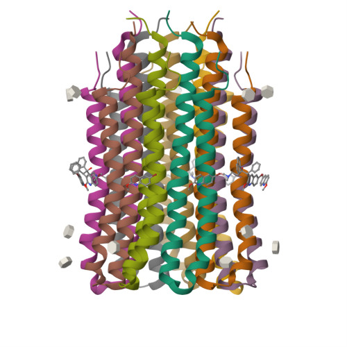
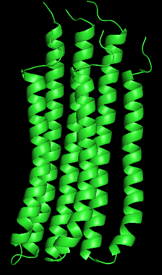
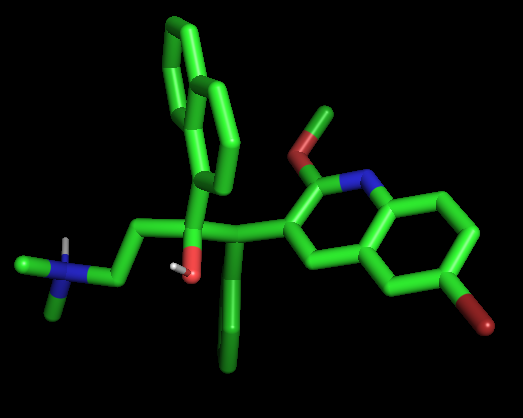
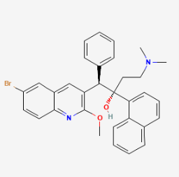
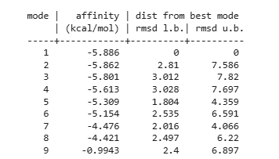
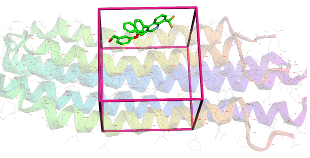

# Similiar-Ligands-Searching-n-Molecular-Docking

**This script searches for ligands, similar to the reference molecule, in pubchem database and performs auto-docking of the found compounds with the selected protein.**

**The example shows the process for the Bedaquiline ligand and its main target protein 4V1F**

**Bedaquiline, also known as BQ1, is used in the treatment of tuberculosis. BQ1 blocks the action of ATP synthase 4V1F in Mycobacterium tuberculosis, inhibiting its growth and causing its death. BQ1 binds and forms a complex with 4V1F, disrupting the function of the proton pump.**

# 4V1F AND BQ1 COMPLEX

# 4V1F_RECEPTOR.PDB

# BEDAQUILINE.PDB

# BEDAQUILINE IN 2D

# RESULTS OF DOCKING FOR BQ1 AT 4V1F

# RESULTS OF DOCKING FOR SIMILIAR COMPOUNDS (affinity: kcal/mol)
**[(-5.574, 'Bedaquiline'), (-4.721, 'Dimethisoquin'), (-5.758, 'Rev5901'), (-6.058, 'TAN-67'), (-4.879, 'TBAJ-587'), (-4.601, 'TBAJ-876'), (-5.959, '104628-26-4'), (-6.551, 'SN-11'), (-6.275, 'SN-28'), (-5.481, '2165340-32-7'), (-5.509, '9-Methoxyacridine'), (-5.544, '2-(4-methoxyphenyl)quinoline'), (-5.436, '4-methoxy-2-phenylquinoline'), (-6.001, '9-(((3-Methoxyphenyl)methyl)amino)-1,2,3,4-tetrahydro-1-acridinol'), (-6.073, '9-(((4-Methoxyphenyl)methyl)amino)-1,2,3,4-tetrahydro-1-acridinol'), (-5.924, '1,2,3,4-Tetrahydro-9-((3-phenoxypropyl)amino)-1-acridinol'), (-5.403, '2,3-Bis(2-methoxyphenyl)quinoxaline'), (-4.751, '4-methoxy-2-pentylquinoline'), (-6.469, 'SN-23'), (-4.895, 'CHEMBL65024'), (-5.489, 'BDBM8911'), (-7.439, '4-[3-(3-Benzyl-8-trifluoromethyl-quinolin-4-yl)-phenoxy]-phenol'), (-6.595, 'biaryletheralcoholquinoline,5b'), (-6.542, 'biaryletheralcoholquinoline,5f'), (-5.478, 'CHEMBL394876'), (-7.444, 'biaryletheralcoholquinoline,5a'), (-6.697, 'biaryletheralcoholquinoline,5c')]**

*The ligand with the highest affinity is biaryletheralcoholquinoline,5a with an affinity for protein of -7.444 kcal/mol*

# 3D visualization of a ligand-protein complex for a ligand similar to BQ1 (biaryletheralcoholquinoline,5c)
